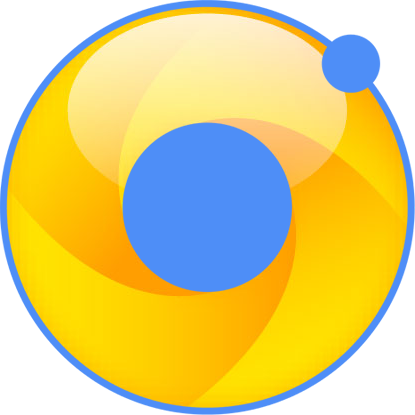

# ionic-wikitude-module

AngularJS module for using the Wikitude cordova plugin in an Ionic project.

# Disclaimer

This project is still under development and should not be used... for now ;)

============


# Ionicitude

AngularJS module for using the Wikitude cordova plugin in an Ionic project.

## Introduction
This bower package is designed for Ionic developers that wants to use the [cordova Wikitude plugin](http://www.wikitude.com/products/extensions/cordova-plugin-augmented-reality/) to add Augmented Reality (AR) in their app. It provides an Angular Service, named Ionicitude, with a simple API to interact with the cordova plugin, wether it be setting, launching or handling request (more about that later).

## What is the cordova Wikitude plugin ?
This is a cordova plugin that allows users to experience Augmented Realtity on their devices. This experience can rely on user's location (think [Ingress](https://www.ingress.com/)) or on image recognition, or both. The possibilities are quite impressive and I encourage you to take a look at [the official Demo app](http://www.wikitude.com/try/)) to grasp the extent of what can be accomplish.
Each of these AR experiences is nothing more than a bunch of HTML/CSS/JS files and is called ARchitect World by the Wikitude staff.

### Important note:
:warning: **The cordova Wikitude plugin relies heavily on the device's hardware and software (camera, accelerometer, compass, etc). Thus, you won't be able to test it anywhere except on a real device. Testing in a browser or an emulator will both fail.**

# Installing the Cordova Wikitude plugin
**This package DOES NOT come along with the cordova Wikitude plugin !**

Since Ionicitude is a service to use the cordova Wikitude plugin, you'll need to first install the plugin on your project, with the following command (that can take a while: it's a heavy plugin):

`ionic plugin add https://github.com/Wikitude/wikitude-cordova-plugin.git`
## Wikitude Licence Key
To use the Wikitude plugin, you have to have a valid licence key. You can obtain one by registering on the Wikitude site, logging in, and accessing the [licence key management page](http://www.wikitude.com/developer/licenses). Here, you can download a free trial licence key for the Wikitude SDK.

The downloaded file is juste a plain text file containing your licence key.

Copy it, go to the `WikitudePlugin.js` file (located at `plugins/com.wikitude.phonegap.WikitudePlugin/www/WikitudePlugin.js`) and paste it as the value to `this._sdkKey` on line 11.

_Note : If you already installed any platform to your project, you'll need to install them again for the plugin modification to propagate (see next point for android platform)._

## Android platform version ^5.0.0
If you want your Ionic app to build correctly for android, with the cordova Wikitude plugin installed, it's absolutely imperative that you add the android platform with at least its `5.0.0` version. Otherwise your build will fail.

If you haven't added the android platform to your project yet, you can do it with:

`ionic platform add android@5.0.0`

If you already added the android platform to your project, please check it's version with this command:

`ionic platform`

If it's lower than `5.0.0`, you will have to update it:

`ionic platform update android@5.0.0`

When it's done, you can check that everything's OK by typing this commande (and crossing your fingers):

`ionic build android`

## Known bugs

Please, be advised that there are actually some awkwards bugs on Android regarding the back button handling from within an AR View, and the user location tracking lifecycle. If you encouter them, please do not raise an issue here but go either on the [Github Wikitude repo](http://github.com/Wikitude/wikitude-cordova-plugin/issues) or on the [Wikitude Developer Forum](http://www.wikitude.com/developer/developer-forum) (you'll need to register).

# Installing Ionicitude
OK ! Now that we have successfully installed the cordova Wikitude plugin (right?), let's use it with Ionicitude. To install Ionicitude, you have two choices.

## With `ionic add`

From within you app's directory, type:

`ionic add tazaf/ionicitude`

_Note : this is just syntactic sugar for `bower install`_

The package will be installed in the `www/lib/ionicitude`.

You will need to add the following line in your app's `index.html`, after the calls to `ionic.bundle.js` and `cordova.js` :
```html
<script src="lib/ionicitude/dist/ionicitude.min.js"></script>
```
Or, if you want the readable version :
```html
<script src="lib/ionicitude/dist/ionicitude.js"></script>
```
## Manually
You can also simply download this project on your computer and place it wherever you like in your project. Then, locate either the `ionicitude.js` file or the `ionicitude.min.js` file, both being in the `dist` folder of the project, and include them in your app's `index.html`, after the calls to `ionic.bundle.js` and `cordova.js` :
```html
<script src="path/to/the/file/ionicitude.min.js"></script>
```
_Note: you'll obviously need to replace `path/to/the/file` with the actual path to the file._

## Registering the dependency
Whatever install method you choose, you'll finally have to register the module in your app's dependencies:
```javascript
// In app.js or wherever you created your app's module
angular.module('app', ['ionic', 'Ionicitude', 'other dependencies']);
```
# Module initialization
Ionicitude needs to actually load the cordova Wikitude plugin to properly function. There's a method for this:
```javascript
Ionicitude.initService();
```
It needs to be called prior to ANY use of the module and only when the device and cordova are ready.

I suggest that you call this function in the `app.run()` block that every Ionic app normally has, specificaly in the `$ionicPlatform.ready()` block.
```javascript
// Should be in the app.js under a slightly different aspect.
angular
.module('app')
.run(run);

function run($ionicPlatform, Ionicitude) {
  $ionicPlatform.ready(function () {
    // Some Ionic code about StatusBar and stuff...
    
    Ionicitude.initService();
  });
}
```
This function loads up the cordova Wikitude plugin with `cordova.require()` and does a couple of other things that we will see later on (checking the device capabilities and initializing the callback for AR Views' calls).

# Checking Device

**_Note: By default, this method is called by `Ionicitude.initService()`. If you want it to skip this checking part, you can pass an object as the method's argument, with at least the proprty `doDeviceCheck` set to `false`_**
```javascript
Ionicitude.initService({
  doDeviceCheck: false
});
```
**_Be advised that if you do skip the checking in the init part, you will have to call the method yourself at one point._**

=

We already saw that an ARchitect World can be geo-based or image-recognition-based, or both. So the device that wants to launch them must support whatever functionnality is needed, and the Wikitude plugin must know wether or not it supports them.
This can be done with this method:
```javascript
Ionicitude.checkDevice();
```
As for now, there's an impressive amount of... two features that an ARchitect World could require:

* `'geo'`: This feature is needed by an ARchitect World when it wants to use the user's location and manipulates geodata in a general way.
* `'2dtracking`: This feature is needed by an ARchitect World when it wants to use image recognition and image tracking.

By default, `checkDevice()` will check if the device supports both of these features. It stores the outcome in the `Ionicitude.deviceSupportsFeatures` property, as a Boolean, and then returns a promise, for you to react to any of the outcome:
```javascript
Ionicitude.checkDevice()
  .then(function(success) {
    // What do you want to do if the device supports eveything ?
  })
  .catch(function(error) {
    // What do you want to do if the device doesn't support at least one of the feature ?
  });
```
# Interaction between the Ionic app and the AR View
It's very important to understand that when the Wikitude plugin launches an AR View, it does not so in the context of your Ionic App. It creates a completely new, independant, agnostic WebView, that comes over your Ionic App's view. That means that all your data, scopes, services, controllers, whatever that your app is using are complete strangers for the AR View.

To overcome this technical problem, the Wikitude staff added some mechanism for the two WebView to communicate. Much like a basic client/server architecture.

Remember when we said earlier that an ARchitect World is ultimately juste HTML/CSS/JS files ? Well, whenever one of the ARchitect World's JS file execute a statement that looks like this one...
```javascript
document.location = 'architectsdk://foo?bar';
```
... that's the signal for the AR View that it needs to call a previsouly registered callback function, and pass it the value of `document.location` as a String argument.
