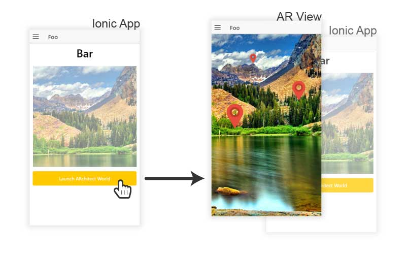
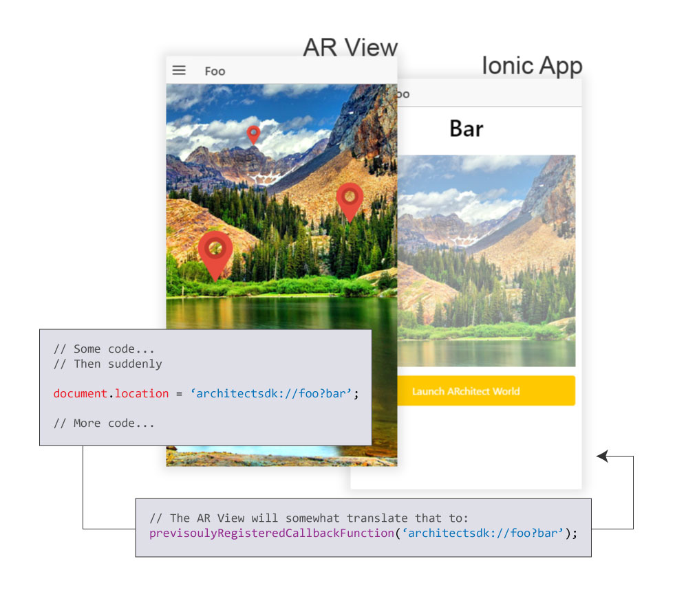

# Ionicitude

AngularJS module for using the Wikitude cordova plugin in an Ionic project.

# Table of content

<!-- START doctoc generated TOC please keep comment here to allow auto update -->
<!-- DON'T EDIT THIS SECTION, INSTEAD RE-RUN doctoc TO UPDATE -->


- [Introduction](#introduction)
  - [Disclaimer](#disclaimer)
  - [What is the cordova Wikitude plugin?](#what-is-the-cordova-wikitude-plugin)
    - [Important note](#important-note)
- [Installing the Cordova Wikitude plugin](#installing-the-cordova-wikitude-plugin)
  - [Wikitude Licence Key](#wikitude-licence-key)
  - [Android platform version ^5.0.0](#android-platform-version-%5E500)
    - [You didn't add any platform ?](#you-didnt-add-any-platform-)
    - [You already added your platform(s) ?](#you-already-added-your-platforms-)
    - [How to check it worked](#how-to-check-it-worked)
  - [Known Android bugs](#known-android-bugs)
- [Installing Ionicitude](#installing-ionicitude)
  - [1a. With `ionic add`](#1a-with-ionic-add)
  - [1b. Manually](#1b-manually)
  - [2. Registering the dependency](#2-registering-the-dependency)
- [Initialization](#initialization)
- [Checking Device's Features](#checking-devices-features)
- [Execute code only when ready](#execute-code-only-when-ready)
- [Launching an AR World](#launching-an-ar-world)
  - [What's an AR World](#whats-an-ar-world)
  - [Expected files organization](#expected-files-organization)
  - [Actually launching an AR World](#actually-launching-an-ar-world)
- [Interaction between the Ionic app and the AR View](#interaction-between-the-ionic-app-and-the-ar-view)
  - [Important explanations ahead!](#important-explanations-ahead)
    - [From: AR View, To: Ionic App](#from-ar-view-to-ionic-app)
    - [From: Ionic App, To: AR View](#from-ionic-app-to-ar-view)
  - [Ionicitude Callback Handling Mechanism (CHM)](#ionicitude-callback-handling-mechanism-chm)
    - [`document.location` URL format](#documentlocation-url-format)
    - [CHM Actions Mapping](#chm-actions-mapping)
- [API Definition](#api-definition)
  - [`addAction()`](#addaction)
  - [`callJavaScript()`](#calljavascript)
  - [`captureScreen()`](#capturescreen)
  - [`checkDevice()`](#checkdevice)
  - [`close()`](#close)
  - [`hide()`](#hide)
  - [`init()`](#init)
  - [`launchAR()`](#launchar)
  - [`ready()`](#ready)
  - [`show()`](#show)
  - [`setLocation()`](#setlocation)

<!-- END doctoc generated TOC please keep comment here to allow auto update -->

# Introduction
This bower package is designed for Ionic developers that wants to use the [cordova Wikitude plugin](http://www.wikitude.com/products/extensions/cordova-plugin-augmented-reality/) to add Augmented Reality (AR) in their app. It provides an Angular Service, named **Ionicitude**, with a simple API to interact with the cordova plugin, wether it be setting it, launching it or handling the AR Views' requests (more about that later).

## Disclaimer
**Please note that this project is not developped in association with or related to neither the Ionic team nor the Wikitude team.**

## What is the cordova Wikitude plugin?
It's a plugin that allows users to experience Augmented Realtity on their device through an hybrid Cordova (or Ionic in our case) app. This AR experience can rely on user's location (think [Ingress](https://www.ingress.com/)) or on images recognition and tracking, or both. The possibilities are quite impressive and I encourage you to take a look at [the official Demo app](http://www.wikitude.com/try/) to grasp the extent of what can be accomplish with the plugin.

An AR Experience is, in the end, nothing more than a bunch of HTML/CSS/JS files. This set of files is called **ARchitect World** by the Wikitude staff.

_Since it's quite a pain to type, I'll call them **AR World** throughout the rest of this README._

### Important note
:warning: **The cordova Wikitude plugin relies heavily on the device's hardware and software (camera, accelerometer, compass, etc). Thus, _you won't be able to test your app (at least the AR part of it) anywhere except on a real device_. Testing it in a browser or an emulator will fail.**

# Installing the Cordova Wikitude plugin
:exclamation: **This package DOES NOT come along with the cordova Wikitude plugin!**

Since Ionicitude is a service that uses the cordova Wikitude plugin, you'll need to first install the plugin on your project. Do it with the following command (that can take a while: it's a heavy plugin):

`ionic plugin add https://github.com/Wikitude/wikitude-cordova-plugin.git`
## Wikitude Licence Key
To use the Wikitude plugin, you have to have a valid **licence key**. You can obtain one by registering on [the Wikitude site](http://www.wikitude.com/developer/documentation/phonegap) (top-right of the screen), logging in, and accessing the [licence key management page](http://www.wikitude.com/developer/licenses). Here, you can download a free trial licence key for the Wikitude SDK.

**Note that the free trial let's you use all the plugin functionnality (geo and 2dtracking) without any time limit, but put a splash screen before every AR World launch and a big "Trial" watermark all over your screen. This is apparently not the case with a paid licence key.**

The downloaded file is juste a plain text file containing your licence key.

Copy it, go to the `WikitudePlugin.js` file (located in your app structure at `plugins/com.wikitude.phonegap.WikitudePlugin/www/WikitudePlugin.js`) and paste it as the value to `this._sdkKey` on line 11.

_Note : If you already installed any platform to your project, you'll need to install them again for the plugin modification to propagate (see next point for android platform)._

## Android platform version ^5.0.0
If you want your Ionic app to build correctly for android, with the cordova Wikitude plugin installed, it's absolutely imperative that you add the android platform with at least its `5.0.0` version. Otherwise your build will fail.

### You didn't add any platform ?

That's cool. But, when you do, don't forget to do it with:

`ionic platform add android@5.0.0`

### You already added your platform(s) ?

Hey, no prob'. You can check your installed android platform version with...

`ionic platform`

...and if it's lower than `5.0.0`, you can update it:

`ionic platform update android@5.0.0`

### How to check it worked

When it's done, you can check that everything's OK by typing this command (and crossing your fingers):

`ionic build android`

If you see an easing `BUILD SUCCESSFULL` at the end of the process, congrats! Your app is building.

## Known Android bugs

Please, be advised that I've been confronted, when using the Wikitude plugin, to some awkwards bugs on Android  devices regarding the back button handling from within an AR View, and the user location tracking lifecycle. If you encouter them or any other bugs related to the Wikitude plugin, please go on the [Github Wikitude repo](http://github.com/Wikitude/wikitude-cordova-plugin/issues) or on the [Wikitude Developer Forum](http://www.wikitude.com/developer/developer-forum) (you'll need to register).

**Having mostly developped with Ionic on Android, I don't know if these bugs also impact iOS builds. From the few tests that I've done, it's apparently not the case.**

# Installing Ionicitude
OK :ok_hand: ! Now that you have successfully installed the cordova Wikitude plugin (right?), it's time to use it with Ionicitude. To install it, you have two choices.

## 1a. With `ionic add`

Using any command ligne tool, go to your app's root directory and type:

`ionic add tazaf/ionicitude`

or

`bower install --save-dev tazaf/ionicitude`

After some download, Ionicitude will be installed on your project. **The files will be locate in `www/lib/ionicitude`.**

You will then need to add the following line in your app's `index.html`, after the calls to `ionic.bundle.js` and `cordova.js` :

```html
<script src="lib/ionicitude/dist/ionicitude.min.js"></script>
```

Or, if you want the humanly readable version :

```html
<script src="lib/ionicitude/dist/ionicitude.js"></script>
```

## 1b. Manually
You can simply [download the latest version of this project](https://github.com/Tazaf/ionicitude/releases) on your computer and place it wherever you like in your project. Then, locate either the `ionicitude.min.js` file **or** the `ionicitude.js` file, both being in the `dist` folder of the downloaded project, and copy them in your own project, wherever you like.

You will then need to include the file in your app's `index.html`, after the calls to `ionic.bundle.js` and `cordova.js` :

```html
<script src="path/to/the/file/ionicitude.min.js"></script>
```

Or, if you copied the humanly readable version :

```html
<script src="path/to/the/file/ionicitude.js"></script>
```

_Note: you'll obviously need to replace `path/to/the/file` with the actual path to the file._

## 2. Registering the dependency
Whatever installing method you choose, you'll finally have to register the module in your app's dependencies:

```javascript
// In app.js or wherever you created your app's module
angular.module('app', ['ionic', 'IonicitudeModule', /* other dependencies */]);
```

# Initialization
Before it can be used, the Ionicitude service needs to be initialized. This means loading the Wikitude plugin and setting up some default Ionicitude behavior. You can do this by calling this method:

```javascript
Ionicitude.init();
```

----------
_Please, see [API Definition > `init()`](#init) for the complete details about this method, or continue reading to see some of them in their context._

----------

:information_source: **This method should be executed before using the module, and only when the device and cordova are ready.**

I suggest that you call this function in the `app.run()` block that every Ionic app normally has, specificaly in the `$ionicPlatform.ready()` block.

```javascript
// Should be in the app.js under a slightly different aspect.
angular
.module('app')
.run(run);

function run($ionicPlatform, Ionicitude) {
  $ionicPlatform.ready(function () {
    // Some Ionic code about StatusBar and stuff...
    
    Ionicitude.init();
  });
}
```
`Ionicitude.init()` is a promise that returns the Ionicitude service as the resolved value. If anything goes wrong while initializing, the error is passed as the rejected value.

# Checking Device's Features

We already saw that an AR World can be geo-based or image-recognition-based, or both. The device that wants to launch such AR World must support whatever features it requires, and the Wikitude plugin must know wether or not the device supports said features.

This can be done with this method:

```javascript
Ionicitude.checkDevice();
```

----------
_Please, see [API Definition > `checkDevice()`](#checkdevice) for the complete details about this method, or continue reading to see some of them in their context._

----------

**_Note: By default, `checkDevice()` is called by `Ionicitude.init()`. If you want `init()` to skip this checking part, you can pass an object as the method's argument, with at least the property `doDeviceCheck` set to `false`_**

```javascript
Ionicitude.init({
  doDeviceCheck: false // This will tell init() to skip the call to checkDevice()
  // Any other init param
});
```

**_Be advised that if you do skip the call to `checkDevice()` in the init part, you will have to call the method yourself at one point. Preferably before you try to launch any AR World :wink:_**

As for now, there's only two features that an AR World can require:

* `'geo'` - This feature is needed by an AR World when it wants to use the user's location and manipulates geodata in a general way.
* `'2d_tracking` - This feature is needed by an AR World when it wants to use image recognition and/or image tracking.

Initially, `checkDevice()` checks if the device supports both of these features, but if your app will ever use only one of them, you can tell that to Ionicitude when initializing the service by passing an object argument to `Ionicitude.init()` with at least a `reqFeatures` array property:

```javascript
// Your app only needs geolocation features ? Do...
Ionicitude.init({
	reqFeatures: ['geo']
});

// Your app only need image tracking and/or recognition ? Do...
Ionicitude.init({
	reqFeatures: ['2d_tracking']
});
```

:grey_exclamation: **Any string in `reqFeatures` that doesn't reference a valid Wikitude feature will not cause the check to fail. It will just be ignored.**

The result of the check will be stored and available through the `Ionicitude.deviceSupportsFeatures` property, as a Boolean.

`checkDevice()` returns you a promise, for you to react to any of the outcome:

```javascript
Ionicitude.checkDevice()
  .then(function(success) {
    // What do you want to do if the device supports eveything?
  })
  .catch(function(error) {
    // What do you want to do if the device doesn't support at least one of the feature?
  });
```

# Execute code only when ready

Please note that `Ionicitude.init()` has some asynchronous behavior (especially while checking the device). This means that some of your code using Ionicitude could be executed before the initialization process is finished, resulting in potential error (see [issue #3](https://github.com/Tazaf/ionicitude/issues/3)).

To ensure that the code using the module is executed only when Ionicitude has done initializing, you can use this method:

```javascript
Ionicitude.ready();
```

----------
_Please, see [API Definition > `ready()`](#ready) for the complete details about this method._

----------

The syntax is exactly like the `$ionicPlatform.ready()` function, provided by Ionic. You encapsulate the code you want to execute inside an anonymous function, passed as the argument to the `Ionicitude.ready()` method. Say you want to launch an AR World (more on that [on the next point](#launching-an-ar-world)), you would write something like this:

```javascript
// This could be in a controller for example.
Ionicitude.ready(function () {
	Ionicitude
		.launchAR('myAR')
		.then(function (success) {
			// ...
		}
		.catch(function (error) }
			// ...
		}
});
```
This will ensure that the launch is done **only** when Ionicitude's initialization is fully completed.

**Some Ionicitude's method can be safely called even if the module is not initialized, so using the `ready()` method is not mandatory for every use case. Nonetheless, it's a good practice to always encapsulate any call the module inside this method, to be extra sure.**

# Launching an AR World

## What's an AR World

The most simplistic AR World possible is just an HTML file (generally `index.html`), that loads up all the Wikitude logic. **See [this Gist](https://gist.github.com/Tazaf/5209e26e9a66e5eb526ed5ad34152586) for a blank minimal `index.html` file to use in your new AR Worlds.**

More advanced AR Worlds contains an HTML file, one or several JS files (with your custom code or third party libraries), maybe some CSS, perhaps some image-tracking related files (specific to Wikitude, see [their documentation](http://www.wikitude.com/external/doc/documentation/latest/phonegap/targetmanagement.html) for more information) or whatever file is useful for this particular AR World..

## Expected files organization
In order to correctly launch your AR Worlds, Ionicitude expects three things:

1. You have a folder named `wikitude-worlds` in your app's `www` folder _(optionnal, see below)_
2. Each of your AR World is contained in a single folder _(named as you like)_ inside `wikitude-worlds`
3. Each AR World folder contains at least an HTML file named `index.html`

If you want to use another name than `wikitude-worlds` for your AR Worlds' root folder (point #1), you can do that by passing an object argument with at least a `worldsRootFolder` property when calling `Ionicitude.init()`:

```javascript
Ionicitude.init({
	worldsRootFolder: 'my-personal-ar-worlds-folder-with-a-much-better-name'
});
```

**You must still follow rules #2 et #3. Otherwise, your world will not load correctly and you won't know why, because Wikitude does not throw an error if you try to load a file that doesn't exist**

In the end, your files organization should look like this:

```
[your app root directory]/
	...
	www/
		...
		wikitude-worlds/ **Or whatever name you set**
			world-foo/
				index.html
				... some other files or folders ...
			world-bar/
				index.html
				... some other files or folders ...
```

## Actually launching an AR World
To launch an AR, simply call the `Ionicitude.launchAR()`, and pass it the name of the folder containing the AR World's files that you want to launch. Say you want to launch the `world-foo` AR World, you would call the method like that:

```javascript
Ionicitude.launchAR('world-foo');
```

----------
_Please, see [API Definition > `launchAR()`](#launchar) for the complete details about this method._

----------

This will take the `index.html` file inside the `world-foo` folder, and launch an AR View with it.

`launchAR()` returns a promise, for you to react to any outcome:

```javascript
Ionicitude.launchAR()
	.then(function(success) {
		// What to do when the launch is successfull
	})
	.catch(function(error) {
		// What to do when the launch has failed
	});
```

**:warning: Note that if you try to launch an AR World on a device that didn't successfully passed the `checkDevice()` test, `Ionicitude.launchAR()` will throw an `UnsupportedFeatureError`.**

# Interaction between the Ionic app and the AR View

## Important explanations ahead!

It's very important to understand that when the Wikitude plugin launches an AR View, it does not so in the context of your Ionic App. It creates a completely new, independant, agnostic WebView, that comes over your Ionic App WebView (check the following diagram). This means that all your data, scopes, services, controllers or whatever your app is using are complete strangers for the AR View.



To overcome this, the Wikitude staff added some callback mechanism for the two WebViews to communicate, much like a basic client/server architecture, the AR View being the client, and your app being the server.

### From: AR View, To: Ionic App

Remember when I said earlier that an AR World is ultimately juste HTML/CSS/JS files? Well, whenever one of your AR World's JS file execute a `document.location` statement that starts with `architectsdk://`, like this one...

```javascript
// Somewhere in an AR World'JS file
document.location = 'architectsdk://foo?bar';
```

... that's the signal for the AR View that it needs to call a previsouly registered callback function on the Ionic App (more on that [later](#ionicitude-callback-handling-mechanism-chm)), and pass it the URL _(the value of `document.location`)_ as a String argument.



This previsouly registered callback function is then responsible of analyzing, interpreting and executing whatever it's asked to do by the URL.

Thankfully, Ionicitude provides you with it's own callback handling mechanism, so you wouldn't have to worry about that. But you can still set up your own mechanism, if you want. Please, see [Ionicitude Callback Handling Mechanism](#ionicitude-callback-handling-mechanism-chm) for more details.

### From: Ionic App, To: AR View
If you want your Ionic App to trigger some behavior inside the AR View (in reaction to an AR View `document.location` call, for example), you can use `Ionicitude.callJavaScript()` _(mind the capital 'S')_ to do so.

----------
_Please, see [API Definition > `callJavaScript()`](#calljavascript) for details about this method._

----------


**For now, this method is just a wrapper around the Wikitude's `callJavaScript` function.**

This method works kinda like `eval()`. You pass it a javascript statement as a String argument, and it will try to execute this statement on the context of the AR View. 

```javascript
// Somewhere in your Ionic code
Ionicitude.callJavascript('getQuestion(42)');
```

This will call the `getQuestion()` function, passing it `42` as it's only argument.
**Note that `getQuestion()` must be defined in the AR World's JS, not on your Ionic App's JS.**

This `callJavaScript()` method is designed to be called only when an AR View is currently active. If you try to call `Ionicitude.callJavaScript()` without having any active AR View, nothing will happen.


## Ionicitude Callback Handling Mechanism (CHM)
Ionicitude comes with it's own Callback Handling Mechanism (CHM) to deal with `document.location` calls. It is enabled by default when calling `Ionicitude.init()`, but you can use your own if you like. You'd just have to pass an object with at least a `customCallback` property as an argument to the `Ionicitude.init()` function. The value of `customCallback` must be a function that takes one argument, the URL:

```javascript
Ionicitude.init({
	// Using your custom CHM over Ionicitude's one.
	customCallback: function(arViewUrl) {
		// Do whatever handling you want to do with every document.location call's URL received from an AR View
	}
});
```

**If you do use your personnal CHM, you can skip the rest of this section.**

### `document.location` URL format

To properly function, Ionicitude's CHM needs that every URL passed as a value to `document.location` in an AR World's JS follows a particular format.

1. The URL needs to start with `architectsdk://`, as this is a requirement from the Wikitude plugin _(you could store that somewhere in a variable to avoid rewriting it everytime)_.
2. The following characters must be the name of the Action that the AR View want the Ionic App to execute, or, in other words, the name of the function that will be called by the Ionic App.
3. If this function needs argument(s)...
	1. the name of the Action in point #2 must be followed by the `?` character.
	2. the remaining characters must form a valid JSON Object declaration. Each of this object property being one of the needed arguments.

#### Valids AR View's URL
All the following `document.location`'s URLs will be correctly interpreted and executed by the CHM:

* `"architectsdk://foo"` will call the `foo` Action with no argument
* `"architectsdk://foo?{"bar":"baz"}"` will call the `foo` Action with `{bar: "baz"}` as its argument
* `"architectsdk://foo?{"bar": 1, "baz": {"fooBar": 123}}"` will call the `foo` Action with `{bar: 1, baz: {fooBar: 123}}` as its argument

#### Invalids AR View's URL
All the following URLs will fail, throwing a `SyntaxError`:

* `foo` - URL does not start with `architectsdk://`
* `architectsdk://foo()` - the parenthesis must not be present
* `architectsdk://foo{"bar": "baz"}` - the `?` character is missing between the Action's name and the JSON Object argument
* `architectsdk://foo?bar` - the characters following the `?` must form a valid JSON Object.

### CHM Actions Mapping
Obviously, the Action name that you pass in the `document.location`'s URL must match an existing function, somewhere. By default, Ionicitude's CHM will try and execute this function from it's own Action library. But because Ionicitude is _(sadly)_ not omniscient, it can not already contain everything that your AR View could call. In fact, its kinda empty in the beginning.

#### Registering Actions
You'll have to register an Action to Ionicitude's library before calling it from inside an AR View. Do this by calling `Ionicitude.addAction()` and passing it either a **name** and an **anonymous** function as a callback, or just a **named** function. **Anything else will throw a TypeError.**

----------
_Please, see [API Definition > `addAction()`](#addaction) for details about this method._

----------

This is **OK**:

```javascript
// Give a string name and an anonymous function.
Ionicitude.addAction('foo', function() {
	// Some code describing what the 'foo' Action does.
});
```

```javascript
// Declare the function and then give it to the method.
function foo() {
	// Some code describing what the 'foo' Action does.
}

Ionicitude.addAction(foo);
```

```javascript
// Give a named function directly to the method.
Ionicitude.addAction(function foo() {
	// Some code describing what the 'foo' Action does.
});
```

This is **NOT OK**:
```javascript
// Don't pass only an anonymous function.
Ionicitude.addAction(function() {
	// Some code describing what the Action does.
});
```

**Be sure to register the Action BEFORE your AR View calls it.**

To register multiple Actions one after another, you can simply chain your calls to `Ionicitude.addAction()`:

```javascript
// As you can see, the method you chose to use doesn't matter
function foo() { /* Some code */ }

Ionicitude
	.addAction(foo)
	.addAction('bar', function() { ... })
	.addAction(function baz() { ... });

// Ionicitude's Action library now contains three Actions
// — 'foo', 'bar' and 'baz' —
// that can be called with a 'document.location' statement.
```

#### Action's arguments
When called by a `document.location` statement, a registered Action's callback will receive two arguments:

* `service`: The Ionicitude service, if you need to call any method from its [API](#api-definition)
* `param`: An object containing, as its properties, your callback's arguments, when provided by the `document.location` statement (see [`document.location` URL format](#documentlocation-url-format))

#### Full example

To wrap up all this Action business, here is a example.

Let's say that your `document.location` statement looks like this:
```javascript
// In your AR View's JS
document.location = 'architectsdk://foo?{"bar":"Some argument value", "baz": 125.252}'
```

Then, your `param` argument's value will translate to...
```javascript
// You don't have to write this anywhere, it's just a clearer way to look at the data
{
	bar: "Some argument value",
	baz: 125.252
}
```
... and your `foo` Action should be registered like this...
```javascript
// Somwhere in your Ionic App's JS, but after calling Ionicitude.init()
Ionicitude.addAction(function foo(service, param) {
	// You can access your param properties
	console.log(param.bar); // Will print : "Some argument value", in the console of the Ionic WebView
	console.log(param.baz); // Will print : 125.252, in the console of the Ionic WebView
	
	// You can also access the Ionicitude service API
	service.close(); // Or any other API's function
});
```

**If your Action only needs the `param` argument without the `service` one, its callback still must accept the two arguments in the right order : `function foo(service, param) { ... }`.**
**But if your Action needs only to interact with the `service`, its callback could accept one argument : `function foo(service) { ... }`.**

# API Definition

## `addAction()`
Adds an Action to the Ionicitude Action Library that can then be triggered by an AR View, with a `document.location` statement. You can add an action by either passing a **name** and an **anonymous** callback, or just a **named** callback.

When called, the callback will be passed to arguments: `service`, the Ionicitude Service for you to call any of its method, and `param`, the object passed in the `document.location` URL. Declare your callback argument depending on its needs.

The Ionicitude Service is returned so that you can chain calls to `addAction()`.

#### Arguments

Name|Type|Description
----|----|-----------
nameOrFunction|`STRING`/`FUNCTION`|If `STRING`, the name of the Action to add. If named `FUNCTION`, the Action to add under the same name.
callback|`FUNCTION`|_[Optionnal]_ If `nameOrFunction` is of type `STRING`, an anonymous function to add as the Action.

#### Returns
- `OBJECT` - The Ionicitude Service

#### Throws
- `TypeError` when
	1. `nameOrFunction` is neither a `STRING` nor a `FUNCTION`
	2. `nameOrFunction` is a `STRING` and `callback` is not present or `null`
	3. `nameOrFunction` is a `STRING` and `callback` is not a `FUNCTION`
	4. `nameOrFunction` is an anonymous `FUNCTION`
- `SyntaxError` when
	1. The name of the Action to add has already been used for a previsouly registered Action

#### Usage
```javascript
Ionicitude
	.addAction('foo', function(service) {
		// This Action is named 'foo' and can access the Ionicitude Service API	
	}
	.addAction('bar', function(service, param) {
		// This Action is named 'bar' and can access both
		// the Ionicitude Service API (even if it doesn't need to)
		// and as any 'param' it needs
	}
	.addAction('baz', function() {
		// This Action is named 'baz' and doesn't need neither the Ionicitude Service nor any 'param'.
	};
```


## `callJavaScript()`
_This is a just a wrapper around the Wikitude plugin's `callJavaScript` function. See [Official Doc](http://www.wikitude.com/external/doc/documentation/latest/phonegap/referencephonegap.html#calljavascript) for more information._

Allows you to executre a JavaScript statement from the Ionic App into the context of the currently active AR View.

#### Arguments

Name|Type|Description
----|----|-----------
js|`STRING`|A litteral javascript statement to execute in the context of the currently active AR View.

#### Usage
```javascript
// Will prompt an alert in the AR View
Ionicitude.callJavaScript('alert(\'Hello\')');
```

## `captureScreen()`
_This is a wrapper around the Wikitude plugin's captureScreen function but it implements promises instead of callbacks. See [Official Doc](http://www.wikitude.com/external/doc/documentation/latest/phonegap/referencephonegap.html#capturescreen) for more information._

Allows you to take a screenshot of the currently active AR View.
#### Arguments
Name|Type|Description
----|----|-----------
withUI|`BOOLEAN`|Indicates wether or not the AR View UI should be part of the screenshot.
fileNameOrPath|`STRING`/`NULL`|If it's a file name or a file path, the screenshot will be saved in the application bundle. If `NULL`, the screenshot will be saved in the device photo gallery.

#### Returns
- `PROMISE` - A promise of a screenshot.

#### Usage
```javascript
Ionicitude.captureScreen(true) // Screenshot will contain AR View UI and will be saved in the photo gallery.
	.then(function(success) {
		// React to a successfully captured screen
	}
	.catch(function(error) {
		// React to a failed captured screen
	};
```

## `checkDevice()`
_This method is called by the Ionicitude.init() method. You can force-skip this call by passing and argument to `Ionicitude.init()` (see [API Definition > `init()`](#init) for details). You should then manually call this method before launching an AR World._

Checks if the device supports the features needed by your app.
The result of the check will be available through the `Ionicitude.deviceSupportsFeatures` property.

By default, the needed features against which the device is check are `geo` and `2d_tracking`. You can change that by passing an argument to `Ionicitude.init()` (see [API Definition > `init()`](#init) for information).

#### Returns
- `PROMISE` - A promise of a check result.

#### Usage
```javascript
Ionicitude.checkDevice()
	.then(function(success) {
		// React to a device supporting all the requested features
	}
	.catch(function(error) {
		// React to a device not supporting at least one of the requested features
	};
```

## `close()`
_This is a just a wrapper around the Wikitude plugin's `close` function. See [Official Doc](http://www.wikitude.com/external/doc/documentation/latest/phonegap/referencephonegap.html#close) for more information._

Close the currently active AR View, and returns to the Ionic App last view.

#### Usage
```javascript
Ionicitude.close();
```
## `hide()`
_This is a just a wrapper around the Wikitude plugin's `hide` function. See [Official Doc](http://www.wikitude.com/external/doc/documentation/latest/phonegap/referencephonegap.html#hide) for more information._

Allows you to hide the currently active AR View, in order to show it again at a later time using `Ionicitude.show()` (see [API Definition > `show()`](#show) for details).

#### Usage
```javascript
Ionicitude.hide();
```
## `init()`
**Must be called prior to any other Ionicitude's API call.**

Initializes the Ionicitude Service, then returns it for you to chain methods calls, if necessary.

This initialization first loads up the Wikitude plugin, then sets up the Ionicitude's CHM (see [Ionicitude Callback Handling Mechanism](#ionicitude-callback-handling-mechanism-chm) for more information) and, finally, calls Ionicitude.checkDevice() (see [API Definition > `checkDevice()`](#checkdevice) for more information).

**Note that this method is designed to be called one time, and one time only. If you call it a second time, ~~you'll break the space-time continuum~~ nothing will happen.**

#### Arguments
You can change the method's default behavior or modify some of the service's settings by passing an **object** as the method's argument. This object can have the following properties, that are all optionnal:

Name|Type|Description
----|----|-----------
customCallback|`FUNCTION`|Default to [Ionicitude CHM](#ionicitude-callback-handling-mechanism-chm). A function that will be used to handle and react to any `document.location` call executed from an AR View's JS code. This function must take one argument, which will be the value of the `document.location` statement.
doDeviceCheck|`BOOLEAN`|Default `TRUE`. Pass `FALSE` to skip the `checkDevice()` method call. If you do, you'll need to manually call the method later on.
reqFeatures|`ARRAY`|Default `['geo', '2d_tracking']`. An array of strings indicating which features are required by your app. Can be `'geo'`, `'2d_tracking'` or both. Anything else will be ignored.
worldLoadConfig|`OBJECT`|Default `{camera_position: 'back'}`. An object of additionnal settings for the AR Views. For now only one setting is available, `camera_position`, that can be either `front` (to use the device front camera) or `back` (to use the device back camera).
worldsRootFolder|`STRING`|Default `"wikitude-worlds"`. A string that references a folder's name in your app in which your AR Worlds' folders are stored (see [Expected File Organization](#expected-file-organization) for more information).

#### Returns
- `OBJECT` - The Ionicitude Service.

#### Usage
```javascript
// Full default usage
Ionicitude.init();

// With custom behavior and/or settings
Ionicitude.init({
	customCallback: function(URL) { /* Handle the URL yourself */ },
	doDeviceCheck: false, // Will skip the call to checkDevice()
	reqFEatures: ["geo"], // checkDevice() will only check the geolocalization feature
	worldLoadConfig: {camera_position: 'front'}, // The front camera will be used by the AR Views.
	worldsRootFolder: "my_custom_world_folder"
});
```

## `launchAR()`
Launch an AR World with the Wikitude plugin, and returns a promise. This creates a new AR View and switches the app's focus to it.

#### Argument
Name|Type|Description
----|----|-----------
world_ref|`STRING`|The name of the folder that contains the files for the AR World to launch. This folder must exist in a folder named `"wikitude-worlds"` in your app's `www` directory. If you want to change the name of this folder (or event it's path), you can by passing an argument to `Ionicitude.init()` (see [API Definition > `init()` ](#init)for details).

#### Returns
- `PROMISE` - A promise of a launched AR World.

#### Throws
- `UnsupportedFeatureError` when:
	1. Trying to launch an AR World that requires features not supported by the device (see [Checking Device's Features](#checking-devices-features))

#### Usage
```javascript
Ionicitude.launchAR("my_world_folder_name")
	.then(function(success) {
		// React to a successfull AR World launching
	})
	.catch(function(error) {
		// React to a failed AR World launching
	});
```

## `ready()`
Encapsulate your code that is using the Ionicitude service in this method. That will ensure that this code is executed only when or if the module has finished initializing.

#### Argument
Name|Type|Description
----|----|-----------
code|`FUNCTION`|An anonymous function that contains the code to execute only when Ionicitude is fully initialized.

#### Usage
```javascript
Ionicitude.ready(function () {
	Ionicitude.launchAR("myAR")
		.then(function(success) {
			// ...
		})
		.catch(function(error) {
			// ...
		});
});
```

## `show()`
_This is a just a wrapper around the Wikitude plugin's `show` function. See [Official Doc](http://www.wikitude.com/external/doc/documentation/latest/phonegap/referencephonegap.html#show) for more information._

Allows you to show a previously hidden AR View.

#### Usage
```javascript
Ionicitude.show();
```
## `setLocation()`
_This is a just a wrapper around the Wikitude plugin's `setLocation` function. See [Official Doc](http://www.wikitude.com/external/doc/documentation/latest/phonegap/referencephonegap.html#setlocation) for more information._

Use this function to inject a user's location into the currently active AR View.

_It's not clear in the Wikitude documentation wether this method should be used for testing purpose (since they use the world "simulated" in the arguments description) or for production purpose. Anyway... since Wikitude automatically tracks the device location on a geolocalization-based AR World, you shouldn't need to call this method._

#### Arguments
Name|Type|Description
----|----|-----------
latitude|`NUMBER`|The latitude (in decimal degree) of the location to inject.
longitude|`NUMBER`|The longitude (in decimal degree) of the location to inject.
altitude|`NUMBER`|The altitude (in meters) of the location to inject.
accuracy|`NUMBER`|The accuracy (in meters) of the location's data.

#### Usage
```javascript
Ionicitude.setLocation(31.2543139, -24.258480555555554, -10000, 20000):
```
